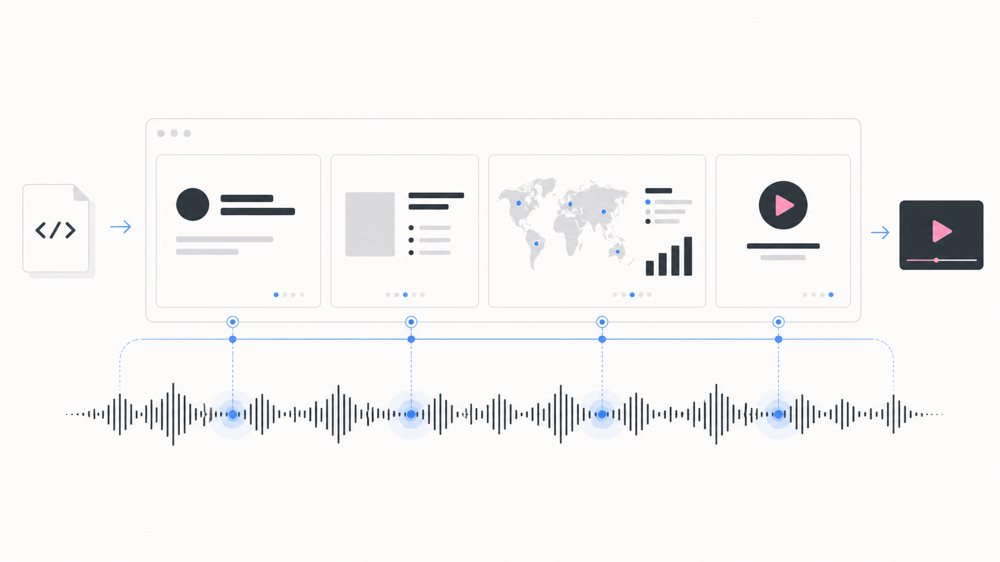

# Synced Slides



A Codex/Claude skill for creating narrated HyperFrames presentation videos where slides, maps, charts, and motion are synchronized to generated or provided voiceover audio.

This repo packages the workflow used for a two-minute pitch deck:

1. Build the deck as HyperFrames HTML.
2. Write a multi-speaker narration script.
3. Generate or import audio.
4. Transcribe the final audio with Whisper.
5. Create a scene cue map from transcript phrases.
6. Remap the HyperFrames timeline to the cue map.
7. Render and verify the final MP4.

## Repository Structure

```text
synced-slides/
├── SKILL.md
├── README.md
├── LICENSE
├── agents/openai.yaml
├── assets/
│   └── landing-image.png
├── references/
│   ├── data-showcases.md
│   ├── hyperframes-sync.md
│   └── tts-and-transcription.md
├── scripts/
│   └── validate_sync.py
└── examples/
    ├── elevenlabs-dialogue.example.json
    └── sync-cues.example.json
```

## Install as a Skill

This repository is intentionally shaped as a portable Agent Skill: the root folder is the skill folder, and `SKILL.md` is the entrypoint.

### NPX

Install into the current project for both Claude Code and Codex:

```bash
npx skills add alrod97/synced-slides --agent claude-code codex --skill synced-slides --copy -y
```

Install globally for both agents:

```bash
npx skills add alrod97/synced-slides --agent claude-code codex --skill synced-slides --global --copy -y
```

Preview what the installer will find without installing:

```bash
npx skills add alrod97/synced-slides --list
```

This requires the GitHub repository to be public, or for the person running the command to have GitHub access to the private repository.

### Claude Code

Install as a personal skill available in every project:

```bash
python3 scripts/install_skill.py --target claude --scope personal
```

Or install into one project only:

```bash
python3 scripts/install_skill.py --target claude --scope project --project-dir /path/to/project
```

Invoke directly in Claude Code:

```text
/synced-slides Create a narrated HyperFrames pitch deck from this outline.
```

Claude Code can also load it automatically when the task matches the skill description.

### Codex

Install as a Codex skill:

```bash
python3 scripts/install_skill.py --target codex
```

Invoke explicitly:

```text
Use $synced-slides to create a narrated HyperFrames pitch deck from this outline.
```

### Local Install Helper

From this checkout, you can install to Claude Code, Codex, or both:

```bash
python3 scripts/install_skill.py --target both
```

For a project-local Claude Code install:

```bash
python3 scripts/install_skill.py --target claude --scope project --project-dir /path/to/project
```

### Claude.ai Upload

Create a ZIP that contains the `synced-slides/` folder, not just the files inside it. The exclusions mirror `scripts/install_skill.py` so generated media, caches, and account-specific payloads stay out of the upload:

```bash
cd ..
zip -r synced-slides.zip synced-slides \
  -x 'synced-slides/.git/*' \
  -x 'synced-slides/.env' 'synced-slides/.env.*' \
  -x 'synced-slides/renders/*' \
  -x 'synced-slides/snapshots/*' \
  -x 'synced-slides/.waveform-cache/*' \
  -x 'synced-slides/.thumbnails/*' \
  -x 'synced-slides/__pycache__/*' \
  -x 'synced-slides/*.mp3' 'synced-slides/*.wav' 'synced-slides/*.m4a' \
  -x 'synced-slides/*.mp4' 'synced-slides/*.mov' 'synced-slides/*.webm' \
  -x 'synced-slides/*.payload.json' \
  -x '*.DS_Store'
```

Upload the ZIP in Claude settings where custom skills are managed.

### GitHub Install

The same folder can be installed by cloning the repo directly into the relevant skill directory:

```bash
git clone https://github.com/alrod97/synced-slides ~/.claude/skills/synced-slides
git clone https://github.com/alrod97/synced-slides ~/.codex/skills/synced-slides
```

## Requirements

- Node.js 22+
- FFmpeg
- HyperFrames CLI: `npx hyperframes`
- Whisper, either through HyperFrames or a local `whisper` command
- Optional TTS provider such as ElevenLabs, Gemini, or OpenAI

Keep provider keys in environment variables. Do not commit `.env` files or API keys.

## Tutorial

### 1. Create or inspect the HyperFrames deck

Start from an existing `index.html` or scaffold a new project:

```bash
npx hyperframes init my-pitch --non-interactive
cd my-pitch
```

Add a `DESIGN.md` that defines the style, narrative arc, scene list, and target runtime. Build the deck as a standalone HyperFrames composition.

### 2. Prepare the narration script

Write the script before generating audio. For ElevenLabs, use text-to-dialogue JSON like:

```json
{
  "model_id": "eleven_v3",
  "inputs": [
    {
      "text": "[calm, confident] You've built a deck. Now imagine it knows when to speak. [pause]",
      "voice_id": "FEMALE_VOICE_ID"
    },
    {
      "text": "[warmly] Not a screen recording. The slides, narration, and timing are authored together. [pause]",
      "voice_id": "MALE_VOICE_ID"
    }
  ]
}
```

Save the payload beside the generated audio:

```text
dialogue-v1.mp3
dialogue-v1.payload.json
```

### 3. Transcribe the final audio

Use HyperFrames first:

```bash
npx hyperframes transcribe dialogue-v1.mp3 --model base.en --language en
```

If the local wrapper fails, use Whisper directly:

```bash
whisper dialogue-v1.mp3 \
  --model base.en \
  --language en \
  --output_format json \
  --word_timestamps True \
  --fp16 False \
  --output_dir .
```

### 4. Build `sync-cues.json`

Create a cue map that aligns scenes to transcript phrases:

```json
{
  "audio": "dialogue-v1.mp3",
  "duration": 123.04,
  "transcript": "dialogue-v1.json",
  "cues": [
    {
      "id": "title",
      "selector": ".scene-1",
      "start": 0.0,
      "end": 14.4,
      "oldStart": 0,
      "oldEnd": 10,
      "anchor": "opening premise"
    }
  ]
}
```

Validate it:

```bash
python3 scripts/validate_sync.py sync-cues.json
```

### 5. Integrate the audio and cues

In `index.html`:

- Add an `<audio>` element with `data-start="0"` and its own `data-track-index`.
- Set the root composition `data-duration` to the final audio duration.
- Use cue times directly, or add a `syncTime()` mapper if the deck already has storyboard timings.

See `references/hyperframes-sync.md` for the code pattern.

### 6. Render and verify

```bash
npx hyperframes lint --verbose
npx hyperframes render --output renders/final.mp4 --quality standard --fps 30
ffprobe -v error -show_entries format=duration -show_streams -of json renders/final.mp4
```

Extract frames around key cue points and inspect the actual rendered video:

```bash
mkdir -p snapshots/sync-check
ffmpeg -y -v error -ss 90.5 -i renders/final.mp4 -frames:v 1 snapshots/world-map.png
ffmpeg -y -v error -ss 118.8 -i renders/final.mp4 -frames:v 1 snapshots/cta.png
```

For map or chart slides, verify that the data surface is clearly visible after compression.

## Publishing Checklist

- `SKILL.md` has concise trigger metadata and workflow instructions.
- `README.md` explains installation and tutorial usage.
- `LICENSE` is present.
- `agents/openai.yaml` is present.
- `npx skills add alrod97/synced-slides --list` finds `synced-slides`.
- Claude Code install paths are documented.
- Codex install paths are documented.
- No `.env`, API keys, generated audio, or rendered videos are committed.
- Example JSON files contain placeholder voice IDs only.
- `python3 scripts/validate_sync.py examples/sync-cues.example.json` passes.

## License

MIT.
